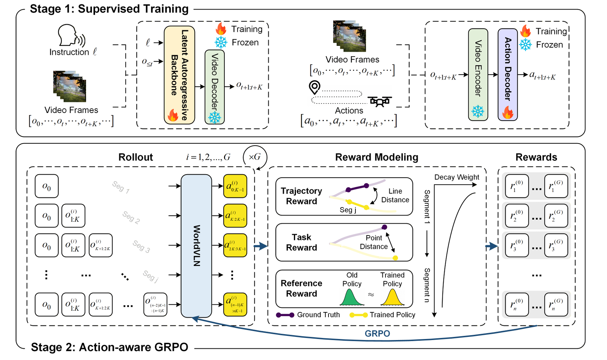
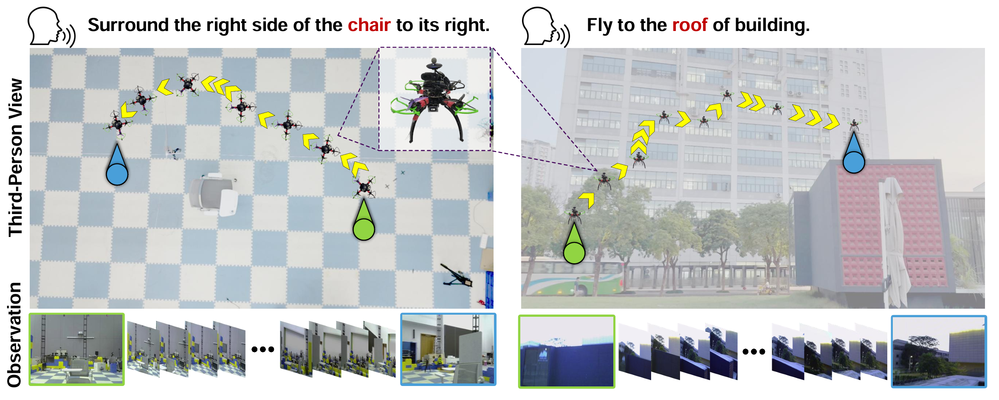

# WorldVLN: Autoregressive World Action Model for Aerial Vision-Language Navigation


This is the official code repository for WorldVLN. The repository includes the main code paths used for backbone training, action decoding, inference serving, and post-training workflows.


## Demo

The following examples illustrate representative WorldVLN behaviors in both generated and real-world settings.

### Generated World Modeling Demo


### Real-World Navigation Demo



## Overview

The current codebase is organized into four major components:

| Directory | Description |
| --- | --- |
| [backbone/](./backbone) | Backbone training code for WorldVLN. |
| [action_module/](./action_module) | Adapter distillation, latent-to-action training, batch inference, and evaluation utilities. |
| [infer/](./infer) | Online inference service for serving the model as an API. |
| [posttrain/](./posttrain) | StageA rollout collection and StageB post-training workflows, including simulator-backed rollout support. |

At a high level, `backbone/` and `action_module/` cover model training and prediction, `infer/` covers deployment-oriented inference, and `posttrain/` covers the later-stage optimization pipeline.

## Installation

We recommend using a single Python 3.10 environment for the released workflows. In our validated launch scripts, the Python interpreter is passed explicitly through `PYTHON_BIN`, so after activating your environment it is recommended to export:

```bash
export PYTHON_BIN=$(which python)
```

### Recommended Environment

1. Create a Python 3.10 environment.

```bash
conda create -n worldvln python=3.10
conda activate worldvln
```

2. Install a PyTorch build that matches your CUDA environment. For the released training and post-training workflows, a PyTorch 2.5.1 environment is the recommended baseline.

3. Install the shared dependencies used by the released workflows.

```bash
pip install -r action_module/requirements.txt
pip install -r posttrain/InfinityStar-main/requirements.txt
pip install fastapi uvicorn pydantic
```

### Notes on Dependencies

- The repository currently contains multiple workflow-specific dependency surfaces.
- [action_module/](./action_module) and [posttrain/](./posttrain) provide the most directly reusable dependency lists for the public workflows.
- [backbone/README.md](./backbone/README.md) and [backbone/TRAINING.md](./backbone/TRAINING.md) should be treated as the installation references for backbone training.
- Some vendored legacy components under [posttrain/TSformer-VO-main/](./posttrain/TSformer-VO-main) carry older requirement files; these should only be installed if you specifically need those paths.

## Setup

### Model Weights

Official WorldVLN backbone weights are available on Hugging Face:

- [WorldVLN backbone weights](https://huggingface.co/anonymous-WorldVLN/WorldVLN/tree/main/WorldVLN_backbone)

Download the weights to your preferred checkpoint directory and configure the relevant training or inference scripts to point to them.

### Additional Assets

Depending on the workflow, you may also need additional runtime assets that are not shipped in this repository.

| Asset | Typical Variable or Path | Used By |
| --- | --- | --- |
| InfinityStar checkpoint | `INFINITY_CKPT` | `infer/`, `posttrain/` |
| Shared T5 and VAE assets | `CHECKPOINTS_DIR` | `posttrain/` and local inference flows |
| Action-head checkpoint | `ACTIONHEAD_CKPT` | `infer/`, `posttrain/` |
| Action-head config | `ACTIONHEAD_RUN_CONFIG` | `infer/`, `posttrain/` |
| Rollout manifest JSON | `SRC_JSON` | `posttrain` StageA |
| UAV-Flow task JSON root | `UAVFLOW_TASK_JSON_ROOT` | `posttrain` remote simulator rollout |
| Replay metadata | `REPLAY_META_DIR` | `posttrain` StageB |

If you are using the post-training pipeline, the asset contract documented in [posttrain/README.md](./posttrain/README.md) should be treated as the source of truth.

## Inference

The repository currently provides two main inference surfaces.

### Online Inference Service

The online service lives under [infer/](./infer) and is intended for deployment-oriented usage.

- Entry points: [infer/run_server.sh](./infer/run_server.sh), [infer/infinity_tsformer_api_server.py](./infer/infinity_tsformer_api_server.py)
- Configuration: [infer/config.json](./infer/config.json)
- Typical usage: serve the model behind an HTTP API for online prediction or system integration

At a high level, this service consumes the current observation context and model inputs, then returns action predictions through the API server.

### Batch Latent-to-Action Inference

The batch inference path lives under [action_module/](./action_module).

- Entry point: [action_module/tools/predict_pose.py](./action_module/tools/predict_pose.py)
- Evaluation script: [action_module/tools/eval_endpoints.py](./action_module/tools/eval_endpoints.py)
- Input format: a route directory containing `latents.pt` and `preprocessed_logs.json`
- Output: predicted actions or trajectory estimates written to the selected output directory

This path is intended for offline inference and evaluation on route-level data rather than online serving.

## Training

Training code is provided for multiple stages of the WorldVLN stack.

### Backbone Training

The backbone training workflow is located under [backbone/](./backbone).

- Entry point: [backbone/scripts/train_from_base.sh](./backbone/scripts/train_from_base.sh)
- Main trainer: [backbone/train.py](./backbone/train.py)
- Detailed guide: [backbone/TRAINING.md](./backbone/TRAINING.md)

Use this workflow when you want to fine-tune the WorldVLN backbone from base checkpoints.

### Action Decoder Training

The action decoder workflow is located under [action_module/](./action_module) and is organized into two stages.

- Stage 1 adapter distillation: [action_module/scripts/train_stage1_ddp.sh](./action_module/scripts/train_stage1_ddp.sh)
- Stage 2 latent-to-action training: [action_module/scripts/train_stage2_ddp.sh](./action_module/scripts/train_stage2_ddp.sh)
- Main scripts: [action_module/tools/train_stage1_ddp.py](./action_module/tools/train_stage1_ddp.py), [action_module/tools/train_stage2_ddp.py](./action_module/tools/train_stage2_ddp.py)

This workflow trains the mapping from visual latent features to 6-DoF motion outputs. Input manifest structure and data expectations are documented in [action_module/README.md](./action_module/README.md).

### Post-Training

The post-training workflow is located under [posttrain/](./posttrain) and is organized into StageA and StageB.

- StageA rollout collection: [posttrain/scripts/run_stagea_collect.sh](./posttrain/scripts/run_stagea_collect.sh)
- StageB partial-freeze optimization: [posttrain/scripts/run_stageb_partialfreeze.sh](./posttrain/scripts/run_stageb_partialfreeze.sh)
- Remote simulator service wrapper: [posttrain/scripts/run_remote_sim_service.sh](./posttrain/scripts/run_remote_sim_service.sh)
- Local inference launcher used by StageA: [posttrain/run_infer_server.sh](./posttrain/run_infer_server.sh)

At a high level:

- StageA consumes rollout sources and model assets, then generates rollout caches and replay metadata.
- StageB consumes replay metadata and runs post-training to produce updated checkpoints and logs.

For simulator-backed rollout and more detailed asset requirements, see [posttrain/README.md](./posttrain/README.md) and [posttrain/docs/remote_sim.md](./posttrain/docs/remote_sim.md).

## License

Please review the license files and documentation within each subdirectory before use.